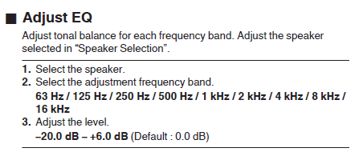

# Audyssey-From-config_dat
extracting Audyssey info from saved config.dat, for older Denon AVR

(translated with help of Copilot) 
I recently bought a slightly older used Denon AVR and started looking for information on how to best configure it.

I found very interesting guides on the Obsessive Compulsive Audiophile YouTube channel (https://www.youtube.com/@ocaudiophile). 

There were instructions for amplifiers like mine, which use a nine band graphic equalizer.

However, I found out that for newer devices there is an even better mechanism using the MULTEQ Editor app, unfortunately my amplifier is not compatible with this application.

Then one day I realized that my amplifier has Audyssey MULTEQ XT32 data, which seems to be much more accurate than the 9 bands available in "Adjust EQ"!

It shows very detailed information about the correction applied for each speaker.

Data with a horizontal resolution of at least 61 values.

